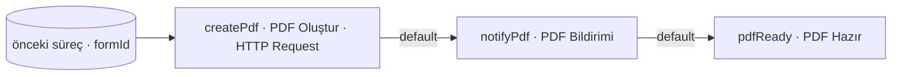

# Örnek Süreç — PDF Oluşturma / Senkron (createPdf)

## Amaç
Bir formun bilgilerinden, **müşteri sunucusunda** çalışan bir custom kod ile **PDF üretmek** ve sonucu kullanıcıya
bildirim olarak iletmek. Bu örnek, **HTTP Request adımının senkron (`async = false`) kullanımını** gösterir: süreç,
dış sunucudaki PDF üretimi **tamamlanana kadar bekler**, sonucu alır ve ilerler.

> **Görsel:** `createPdf.jpg`
> **Not:** Görsel, PDF üretim bölümünü gösterir; bu adımlardan **önce başka bir süreç vardır** (formu hazırlayan akış).
> Bu adıma, önceki süreçten bir aksiyonla `parameters: { formId }` gelir.

## Diyagram

---

## Süreç Adımları

### 1. PDF Oluştur (`createPdf`) — HTTP Request
**Görev:** Form id'sini müşteri sunucusuna gönderip PDF ürettirmek ve sonucu (PDF url'i) almak.
**Bu adıma gelen parametre:** `parameters: { formId }` (önceki süreçten).
**Ayarlar ve çalışma:**
- `endpoint`: müşteri sunucusunun PDF üretim ucu · `method`: `POST`
- `body`: `{ formId }` (gelen parametreden)
- **`async = false`** → istek atılır ve **tamamlanması beklenir**.
- Müşteri sunucusunda, **Flovo Customer API** ile form bilgileri çekilip PDF üreten **custom kod** çalışır; sonuç
  (örn. `pdfUrl`) response ile döner.
- Response bir **action modeli** taşır: `action` boş gelirse **`default`** aksiyonu, response'taki `parameters` ile çalışır.
**Adımın ürettiği parametre:** `pdfUrl` (response'tan).

**Aksiyonlar:**
- **`default` (otomatik):** Hedef adım `notifyPdf`. Taşıdığı veri: `parameters: { formId, pdfUrl }`.
  → Bildirim adımı, mesajı bu parametrelerle (özellikle `pdfUrl`) üretecek.
- _(Opsiyonel `onFail`: PDF üretimi başarısızsa hata kolu — bu örnekte tanımlanmadı.)_

---

### 2. PDF Bildirimi (`notifyPdf`) — Bildirim
**Görev:** Üretilen PDF'i kullanıcıya bildirimle haber vermek.
**Bu adıma gelen parametre:** `parameters: { formId, pdfUrl }`.
**Ayarlar ve çalışma:** Kanal **Mail** ve/veya **Push**. Mesaj, gelen `parameters` ile **dinamik** üretilir (örn.
"#ServiceName PDF'iniz hazır" + `pdfUrl` bağlantısı). Bildirim gönderilir.
**Adımın ürettiği parametre:** — .

**Aksiyonlar:**
- **`default` (otomatik):** Hedef adım `pdfReady`. Taşıdığı veri: `parameters: { formId, pdfUrl }`.

---

### 3. PDF Hazır (`pdfReady`) — Kullanıcı
**Görev:** Formu, PDF bağlantısıyla birlikte kullanıcının önüne getirmek (insan görev noktası).
**Bu adıma gelen parametre:** `parameters: { formId, pdfUrl }`.
**Ayarlar ve çalışma:** Süreç burada **bekler**; form "aksiyon alınabilir" olur. Adıma gelindiğinde form bilgileri,
aksiyonu tetikleyen isteğe response olarak iletilir; kullanıcı formu (ve PDF bağlantısını) görür.
**Adımın ürettiği parametre:** — .
**Aksiyonlar:** — (insan-tetiklemeli; bu örneğin kapsamı dışında).

---

> Asenkron karşılığı: `../createPdfAsync/process.md` (HTTP Request `async = true` + **Webhook** ile geri dönüş).
> İlgili tasarım: `../../servis-ayarlari/process-step.md` (HTTP Request) · `../../flovo-customer-api.md`.
