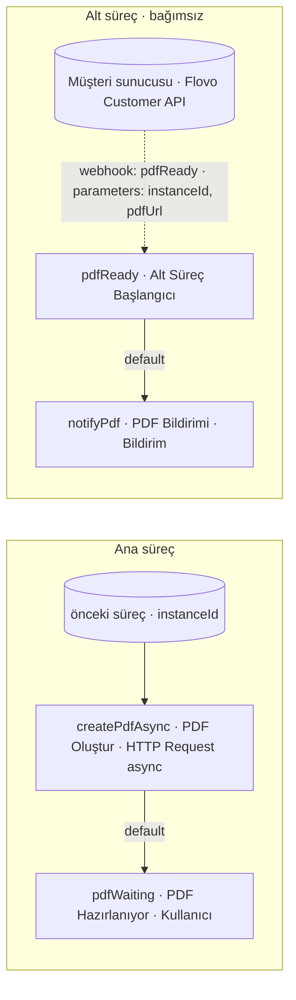

# Örnek Süreç — PDF Oluşturma / Asenkron (createPdfAsync)

## Amaç
`createPdf` ile aynı işi (form bilgisinden PDF üretme) yapar; ama **uzun sürebilen** dış işlemde kullanıcıyı
**bekletmemek** için **asenkron** çalışır. **HTTP Request `async = true`** ile istek atılıp dönüş beklenmez; kullanıcı
hemen ilerler. Müşteri sunucusu PDF'i bitirince, **Flovo Customer API** üzerinden **bağımsız bir alt süreci** tetikleyerek
bildirim kolunu çalıştırır.

> **Görsel:** `createPdfAsync.jpg`
> **Not:** Ana sürecin bu adımlarına önceki bir süreçten `parameters: { instanceId }` gelir.
>
> **Tasarım (önemli):** Bildirim kolu **ana sürecin içinde değildir** — ayrı, **bağımsız bir alt süreçtir** ve giriş
> düğümü bir **Alt Süreç Başlangıcı** (→ `../../service-settings/process-step.md` §3.20) adımıdır. Webhook doğrudan bu
> adımı tetikler; böylece yürütme kaydı **geçerli bir `processStepId` ile** atılır.

## Diyagram

---

## Ana Süreç Adımları

### 1. PDF Oluştur (`createPdfAsync`) — HTTP Request (async)
**Görev:** Müşteri sunucusunda PDF üretimini **başlatmak**, ama tamamlanmasını beklemeden ilerlemek.
**Bu adıma gelen parametre:** `parameters: { instanceId }`.
**Ayarlar ve çalışma:**
- `endpoint`: müşteri sunucusu PDF üretim ucu · `method`: `POST` · `body`: `{ instanceId }`
- **`async = true`** → istek atılır, **dönüş beklenmez**; doğrudan **`default`** aksiyonu tetiklenir.
- Müşteri sunucusu işi kuyruğa alır; bittiğinde geri dönecektir (aşağıdaki **alt süreç**).
**Adımın ürettiği parametre:** — (sonuç beklenmediği için bu adımda üretilmez).

**Aksiyonlar:**
- **`default` (otomatik, async):** Hedef adım `pdfWaiting`. Taşıdığı veri: `parameters: { instanceId }`.

---

### 2. PDF Hazırlanıyor (`pdfWaiting`) — Kullanıcı
**Görev:** Kullanıcıya formu göstermek (durum: *PDF hazırlanıyor*); PDF dışarıda hazırlanırken kullanıcı **beklemez**,
işine devam eder.
**Bu adıma gelen parametre:** `parameters: { instanceId }`.
**Ayarlar ve çalışma:** Form "aksiyon alınabilir" durumda kullanıcıya iletilir. PDF'in gelişi bu adımı **beklemez** —
bildirim, aşağıdaki **bağımsız alt süreç** tarafından yapılır ve açık form o koldan güncellenir.
**Adımın ürettiği parametre:** — .

---

## Alt Süreç (bağımsız) — PDF Bildirimi

> Ana süreçten **ayrık** kurulur; giriş düğümü **Alt Süreç Başlangıcı**'dır. İçinde Kullanıcı / Kullanıcı Grubu /
> Processing / Süreç Bitişi **yer almaz** (kısa ömürlü, otomatik ilerleyen kol → `../../service-settings/process-step.md` §3.20).

### 3. PDF Hazır (`pdfReady`) — Alt Süreç Başlangıcı
**Görev:** Dışarıdan gelen "PDF hazır" tetiğini karşılayıp bildirim koluna başlangıç olmak.
**Nasıl tetiklenir:** **Uygulama dışından** — müşteri sunucusu, PDF bittiğinde **Flovo Customer API** ile bu adımı
çağırır (`POST /instances/{instanceId}/actions/pdfReady`, `parameters: { pdfUrl }`). "Kim tetikledi" → `atApiKeyId`.
**Bu adıma gelen parametre:** `parameters: { instanceId, pdfUrl }`.
**Adımın ürettiği parametre:** — .

**Aksiyonlar:**
- **`default` (otomatik):** Hedef adım `notifyPdf`. Taşıdığı veri: `parameters: { instanceId, pdfUrl }`.

---

### 4. PDF Bildirimi (`notifyPdf`) — Bildirim
**Görev:** PDF'in hazır olduğunu kullanıcıya bildirmek (ve açık forma PDF bağlantısını işlemek).
**Bu adıma gelen parametre:** `parameters: { instanceId, pdfUrl }` (Alt Süreç Başlangıcı'ndan).
**Ayarlar ve çalışma:** Kanal **Mail/Push** (mesaj) ve/veya **Toast** (`parameters` ile açık formu güncelleme). Mesaj,
gelen `pdfUrl` ile dinamik üretilir; `parameters: { instanceId, pdfUrl }` frontende iletilir → açık form PDF bağlantısıyla güncellenir.
**Adımın ürettiği parametre:** — .
**Aksiyonlar:** — (alt sürecin sonu; işini yapıp kapanır).

---

> Senkron karşılığı: `../createPdf/process.md` (HTTP Request `async = false`, beklemeli).
> İlgili tasarım: Alt Süreç Başlangıcı → `../../service-settings/process-step.md` §3.20 · Webhook aksiyonu →
> `../../service-settings/process-step-action.md` §3.6 · API → `../../flovo-customer-api.md`.
>
> **✅ Çözüldü (v0.6):** Önceki tasarımda `pdfReady` bir **Webhook aksiyonu** idi ve bağlanacağı bir süreç adımı olmadığından
> `ProcessStepInstance.processStepId` doğru atılamıyordu. Artık bağımsız alt süreç bir **Alt Süreç Başlangıcı** adımıyla
> başlar; webhook bu adımı tetikler ve içerideki ilerleme **`default`** aksiyonuyla olur. _(Kalan açık ayrıntı: alt sürecin
> `ProcessInstance` temsili → `../../service-settings/process-step.md` §4 · `../../todo.md`.)_
