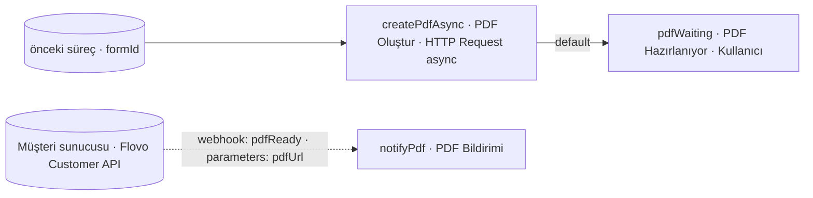

# Örnek Süreç — PDF Oluşturma / Asenkron (createPdfAsync)

## Amaç
`createPdf` ile aynı işi (form bilgisinden PDF üretme) yapar; ama **uzun sürebilen** dış işlemde kullanıcıyı
**bekletmemek** için **asenkron** çalışır. **HTTP Request `async = true`** ile istek atılıp dönüş beklenmez; kullanıcı
hemen ilerler. Müşteri sunucusu PDF'i bitirince, **Flovo Customer API** üzerinden bir **Webhook aksiyonunu** tetikleyerek
sürecin **bildirim kolunu** çalıştırır.

> **Görsel:** `createPdfAsync.jpg`
> **Not:** Bu adımlara önceki bir süreçten `parameters: { formId }` gelir.

## Diyagram

---

## Süreç Adımları

### 1. PDF Oluştur (`createPdfAsync`) — HTTP Request (async)
**Görev:** Müşteri sunucusunda PDF üretimini **başlatmak**, ama tamamlanmasını beklemeden ilerlemek.
**Bu adıma gelen parametre:** `parameters: { formId }`.
**Ayarlar ve çalışma:**
- `endpoint`: müşteri sunucusu PDF üretim ucu · `method`: `POST` · `body`: `{ formId }`
- **`async = true`** → istek atılır, **dönüş beklenmez**; doğrudan **`default`** aksiyonu tetiklenir.
- Müşteri sunucusu işi kuyruğa alır; bittiğinde geri dönecektir (aşağıdaki webhook).
**Adımın ürettiği parametre:** — (sonuç beklenmediği için bu adımda üretilmez).

**Aksiyonlar:**
- **`default` (otomatik, async):** Hedef adım `pdfWaiting`. Taşıdığı veri: `parameters: { formId }`.

---

### 2. PDF Hazırlanıyor (`pdfWaiting`) — Kullanıcı
**Görev:** Kullanıcıya formu göstermek ve PDF'in dışarıda hazırlanmasını bekleyen **webhook aksiyonunu** tutmak.
**Bu adıma gelen parametre:** `parameters: { formId }`.
**Ayarlar ve çalışma:** Form "aksiyon alınabilir" durumda kullanıcıya iletilir (durum: *PDF hazırlanıyor*). Kullanıcı
beklemez/işine devam eder. Bu adımda, dışarıdan tetiklenecek bir **Webhook aksiyonu** (`pdfReady`) tanımlıdır.
**Adımın ürettiği parametre:** — .

**Aksiyonlar:**
- **`pdfReady` (Webhook):** **Uygulama dışından** tetiklenir. Müşteri sunucusu, PDF bittiğinde Flovo Customer API ile
  bu aksiyonu çağırır (`POST /forms/{formId}/actions/pdfReady`, `parameters: { pdfUrl }`). Hedef adım `notifyPdf`.
  Taşıdığı veri: `parameters: { formId, pdfUrl }`.

---

### 3. PDF Bildirimi (`notifyPdf`) — Bildirim
**Görev:** PDF'in hazır olduğunu kullanıcıya bildirmek (ve açık forma PDF bağlantısını işlemek).
**Bu adıma gelen parametre:** `parameters: { formId, pdfUrl }` (webhook'tan).
**Ayarlar ve çalışma:** Kanal **Mail/Push** (mesaj) ve/veya **Toast** (`parameters` ile açık formu güncelleme). Mesaj,
gelen `pdfUrl` ile dinamik üretilir; `parameters: { formId, pdfUrl }` frontende iletilir → açık form PDF bağlantısıyla güncellenir.
**Adımın ürettiği parametre:** — .
**Aksiyonlar:** — (bildirim kolunun sonu).

---

> Senkron karşılığı: `../createPdf/process.md` (HTTP Request `async = false`, beklemeli).
> İlgili tasarım: Webhook → `../../servis-ayarlari/process-step-action.md` §3.6 · API → `../../flovo-customer-api.md`.
