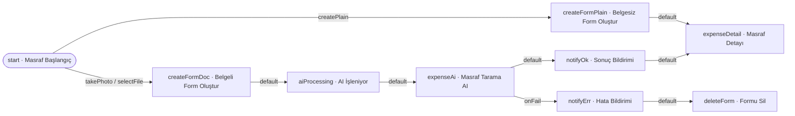

# Örnek Süreç — Masraf Oluşturma (expense)

## Amaç
Kullanıcının bir masrafı **üç farklı yolla** oluşturmasını sağlamak: **fotoğraf çekerek**, **dosya seçerek** veya
**belgesiz** (boş form). Fotoğraf/dosya ile başlatılan masraflarda, belge **Flovo AI (Masraf)** ile taranır; form
alanları otomatik doldurulur ve kullanıcı bu sırada formu **"yükleniyor" (loading) kartı** olarak görür. AI başarılı
olursa form değerlerle güncellenip kullanıcıya sunulur; AI hata verirse kullanıcı bilgilendirilir ve **yarım kalan
form silinir** (telafi). Belgesiz yolda AI çalışmaz; boş form doğrudan kullanıcıya açılır.

> **Görsel:** `expense.jpg`

## Diyagram

---

## Süreç Adımları

### 1. Masraf Başlangıç (`start`) — Süreç Başlangıcı
**Görev:** Sürecin kullanıcı tarafından nasıl başlatılacağını tanımlar. Altındaki üç başlatma aksiyonu, kullanıcının
**"aksiyon bekleyenler"** ekranında görünür ve manuel tetiklenir.
**Bu adıma gelen parametre:** — (yok; süreç burada başlar).
**Ayarlar ve çalışma:** Üç aksiyon da "aksiyon bekleyenler" listesinde görünür biçimde işaretlidir. Kullanıcı birini
tetiklediğinde, o aksiyonun türüne göre native bir araç açılır (kamera/dosya seçici) veya doğrudan ilerlenir.
**Adımın ürettiği parametre:** — (üretmez; seçilen dosyayı aksiyon taşır).

**Aksiyonlar:**

| Aksiyon (`code`) | actionType | Hedef adım | Taşıdığı veri |
|---|---|---|---|
| `takePhoto` — Fotoğraf Çek | Fotoğraf Çek | `createFormDoc` | `parameters: { thumbnailUrl }` |
| `selectFile` — Dosya Seç | Dosya Seç | `createFormDoc` | `parameters: { thumbnailUrl }` |
| `createPlain` — Belgesiz Form Oluştur | Manuel | `createFormPlain` | — (parametre taşımaz) |

- **`takePhoto` / `selectFile`:** Native kamera/dosya aracı açılır; seçilen görsel **yüklenir** ve erişim **url'i**
  alınır. Bu url, `parameters.thumbnailUrl` olarak `createFormDoc` adımına taşınır.
- **`createPlain`:** Dosya okuma yoktur; doğrudan `createFormPlain` adımına ilerler.

---

### 2. Belgeli Form Oluştur (`createFormDoc`) — Form Creator
**Görev:** Masraf görselinden yeni bir masraf formu üretmek.
**Bu adıma gelen parametre:** `parameters.thumbnailUrl` (seçilen masraf görselinin url'i).
**Ayarlar ve çalışma:** Form Creator ayarında **init değer** olarak, gelen `thumbnailUrl` formun **thumbnail url'ine**
eşlenir. Adım çalıştığında yeni bir **form id** ve boş masraf alanları üretilir; formun thumbnail'i bu görsel olur.
**Adımın ürettiği parametre:** `formId` (yeni oluşturulan form).

**Aksiyonlar:**
- **`default` (otomatik):** actionType **Autoaction**. Hedef adım `aiProcessing`. Taşıdığı veri:
  `parameters: { formId, thumbnailUrl }`. → Sonraki adım form id ile çalışacağı için formId taşınır.

---

### 3. AI İşleniyor (`aiProcessing`) — Processing
**Görev:** AI tarama sürerken kullanıcıya formu **"yükleniyor"** olarak göstermek; arka planda AI adımına ilerlemek.
**Bu adıma gelen parametre:** `parameters: { formId, thumbnailUrl }`.
**Ayarlar ve çalışma:** **`showLoading = true`**. Süreç başlatan = aksiyonu tetikleyen kullanıcı. Adıma gelindiğinde
**`formId` + showLoading**, aksiyonu tetikleyen frontend HTTP isteğine **response** olarak döner; kullanıcı formu
**loading kartı** olarak görür (forma giremez). Aynı anda otomatik olarak AI adımına ilerler.
**Adımın ürettiği parametre:** — (yeni parametre üretmez; `formId`'yi taşır).

**Aksiyonlar:**
- **`default` (otomatik):** actionType **Autoaction**. Hedef adım `expenseAi`. Taşıdığı veri:
  `parameters: { formId }`. → AI adımı, formId ile formun thumbnail'ine erişip dosyayı işler.

---

### 4. Masraf Tarama AI (`expenseAi`) — Flovo AI
**Görev:** Masraf görselini AI ile tarayıp form alanlarını (tutar, tarih, satıcı, KDV...) çıkarmak.
**Bu adıma gelen parametre:** `parameters: { formId }`.
**Ayarlar ve çalışma:** AI türü = **Masraf**. Dosya kaynağı = **formun thumbnail url'i** (formId üzerinden). AI çalışır,
alan değerlerini üretir.
**Adımın ürettiği parametre:**
- Başarılı: `extractedFields` (alan→değer eşlemesi).
- Hata: `errorMessage`.

**Aksiyonlar:**
- **`default` — başarı (Autoaction):** Hedef adım `notifyOk`. Taşıdığı veri:
  `changeList: [ extractedFields → form alanları ]` **+** `parameters: { formId }`.
  → `changeList`, bir sonraki adım (notifyOk) iş yapmadan **önce forma uygulanır** (alanlar AI değerleriyle güncellenir).
- **`onFail` — hata (Autoaction):** Hedef adım `notifyErr`. Taşıdığı veri: `parameters: { formId, errorMessage }`.

---

### 5. Sonuç Bildirimi (`notifyOk`) — Bildirim
**Görev:** AI'nin doldurduğu formu frontende **veri-itme bildirimi** ile göndererek loading kartını gerçek forma çevirmek.
**Bu adıma gelen parametre:** `changeList` (forma uygulanır) + `parameters: { formId }`.
**Ayarlar ve çalışma:** Kanal **Toast** (veya Push), **mesaj yok** — yalnız **`parameters` modu**. Adıma girişte
`changeList` forma uygulanır (alanlar güncellenir). Ardından `parameters: { formId, güncel alan değerleri }` frontende
**bildirim** olarak gönderilir. Frontend `formId` ile **loading formu bulur**, normal görünüme AI değerleriyle günceller.
**Adımın ürettiği parametre:** — .

**Aksiyonlar:**
- **`default` (Autoaction):** Hedef adım `expenseDetail`. Taşıdığı veri: `parameters: { formId }`.

---

### 6. Masraf Detayı (`expenseDetail`) — Kullanıcı
**Görev:** Masrafı, oluşturan kullanıcının önünde **aksiyon alınabilir** form olarak göstermek (insan görev noktası).
**Bu adıma gelen parametre:** `parameters: { formId }`.
**Ayarlar ve çalışma:** Süreç burada **durur ve bekler**; form "aksiyon alınabilir" olur. Kullanıcı formu görüntüler/
düzenler, sonraki onay aksiyonlarını manuel alır (bu örnekte sonrası tanımlanmadı).
**Adımın ürettiği parametre:** — (kullanıcı aksiyonuna bağlı).
**Aksiyonlar:** — (insan-tetiklemeli; bu örneğin kapsamı dışında).

---

### 7. Hata Bildirimi (`notifyErr`) — Bildirim
**Görev:** AI hatasını kullanıcıya **toast** ile bildirmek ve loading kartını kaldırmak.
**Bu adıma gelen parametre:** `parameters: { formId, errorMessage }`.
**Ayarlar ve çalışma:** Kanal **Toast**. **Mesaj = `errorMessage`** + **`parameters: { formId }`**. Kullanıcı hatayı toast
olarak görür; frontend `formId` ile **loading formu kaldırır**.
**Adımın ürettiği parametre:** — .

**Aksiyonlar:**
- **`default` (Autoaction):** Hedef adım `deleteForm`. Taşıdığı veri: `parameters: { formId }`.

---

### 8. Formu Sil (`deleteForm`) — Form Silme
**Görev:** AI başarısız olduğu için **yarım kalan formu** silmek (telafi).
**Bu adıma gelen parametre:** `parameters: { formId }`.
**Ayarlar ve çalışma:** `formId`'li form **`deleted`** durumuna çekilir. Bu, hata kolunun **son adımıdır** (süreç biter).
**Adımın ürettiği parametre:** — .
**Aksiyonlar:** — (terminal).

---

### 9. Belgesiz Form Oluştur (`createFormPlain`) — Form Creator
**Görev:** Belge olmadan **boş bir masraf formu** üretmek.
**Bu adıma gelen parametre:** — (yok).
**Ayarlar ve çalışma:** Init değer/thumbnail yoktur; yeni **form id** ve boş alanlar üretilir.
**Adımın ürettiği parametre:** `formId`.

**Aksiyonlar:**
- **`default` (Autoaction):** Hedef adım `expenseDetail`. Taşıdığı veri: `parameters: { formId }`.
  → Tetikleyen HTTP isteğine response olarak form bilgileri döner; frontendde form doğrudan görüntülenir.

---

> İlgili tasarım: adımlar → `../../service-settings/process-step.md` · aksiyon/veri aktarımı →
> `../../service-settings/process-step-action.md` · Flovo Customer API → `../../flovo-customer-api.md`.
