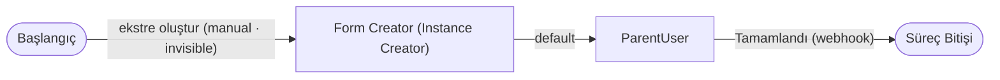
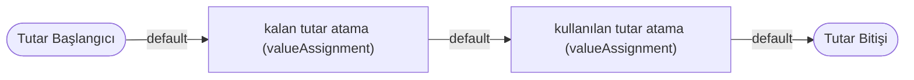

# Örnek Süreç — Kredi Kartı Ekstresi / Ekstre (`creditCardStatement`) — TASLAK

> **Durum:** 🟡 TASLAK — görselden ilk çıkarım (diyagram + aksiyon/trigger taslağı). Detay sonra eklenecek.
> **Servis grubu:** `expenseAndCreditCard` (4 bağlantılı servis) → [`index.md`](./index.md)
> **Görsel:** `creditCardStatement.jpg`
> **Amaç:** Bir **kredi kartı ekstresini** temsil eder. Ekstre, altında **Ekstre Satırları** barındırır; satırlardaki
> tutarlar üzerinden **kalan / kullanılan tutar** hesaplanır. Ana akış ekstreyi oluşturur; **Tutar** alt süreci,
> tutar güncellemelerinde (Ekstre Satırı'ndan tetiklenerek) çalışır.

## Ana Süreç Diyagramı

## Alt Süreç — Tutar

## Süreç adımları (taslak)
| # | Adım | Tip | Rol |
|---|---|---|---|
| 1 | Başlangıç | Süreç Başlangıcı | Tek aksiyon: **ekstre oluştur** (`manual`, **displayType=invisible**) — bağımsız başlatılamaz; yalnız Masraf Formu'ndaki ekstre Form List'i üzerinden oluşur |
| 2 | Form Creator | Instance Creator | Ekstre instance'ı üretir |
| 3 | ParentUser | **Üst Form Kullanıcı** (human task) | Ayar: `parentServiceId`=**Masraf Formu**, `associatedPropertyId`=**ekstre Form List'i**; görüntüleme profili + aksiyon bekleyenler üst formdan devralınır. Tamamlar |
| — | Süreç Bitişi | Süreç Bitişi | — |
| — | Tutar Başlangıcı | **Alt Süreç Başlangıcı** (`subProcessStart`) | Tutar güncelleme alt süreci girişi |
| — | kalan tutar atama | Değer Atama | Ekstrenin kalan tutarını hesaplar/atar |
| — | kullanılan tutar atama | Değer Atama | Ekstrenin kullanılan tutarını hesaplar/atar |
| — | Tutar Bitişi | **Alt Süreç Bitişi** (`subProcessEnd`) | Tutar alt sürecinin çıkış düğümü |

## Aksiyonlar (taslak)
| Kaynak adım | Aksiyon | actionType | Hedef adım | Durum |
|---|---|---|---|---|
| Başlangıç | **ekstre oluştur** | `manual` · **actionDisplayType: `invisible`** | Form Creator | — |
| Form Creator | default | `autoAction` | ParentUser | — |
| ParentUser | Tamamlandı | `webhook` | Süreç Bitişi | — |
| Tutar Başlangıcı | default | `autoAction` | kalan tutar atama | — |
| kalan tutar atama | default | `autoAction` | kullanılan tutar atama | — |
| kullanılan tutar atama | default | `autoAction` | Tutar Bitişi | — |

## ServiceTrigger (otomatik tetikleyiciler)
- Bu servis görselinde **ServiceTrigger tablosu yok**. **Tutar** alt süreci, **Ekstre Satırı**'nın
  **"Ekstre Tutar Alt süreç Başlat"** adımıyla (`triggerProcessStep`) tetiklenir (→ [`creditCardStatementLine.md`](./creditCardStatementLine.md)).

## Önemli Alanlar (properties)
| Alan (`code`) | Tip | Açıklama |
|---|---|---|
| `creditCardStatementId` | **flowInfo → instanceId** | Ekstrenin kimliği = kendi `instanceId`'si (akış bilgisinden otomatik dolar; salt-okunur). **Masraf Formu** bu değeri listesine ekleyince kendi `creditCardStatementId` textbox'ına kopyalar (→ [`expenseForm.md`](./expenseForm.md) **İK-2**). |
| `creditCardStatementLines` | **Form List** → Ekstre Satırı | Ekstrenin **satırları** (Ekstre Satırı instance'ları). Aşağıdaki üç toplam bu liste üzerinden hesaplanır. |
| `totalAmount` | Numeric | Satırların `amount` toplamı (`totalAmountAtama`). |
| `remainingAmount` | Numeric | Satırların `remainingAmount` (kalan) toplamı (`remainingAmountAtama`). |
| `usedAmount` | Numeric | Satırların `usedAmount` (kullanılan) toplamı (`usedAmountAtama`). |

## İş Kuralları (business rules)
> Model → [`../../models/service-settings/business-rule.md`](../../models/service-settings/business-rule.md). Her kural,
> `creditCardStatementLines` Form List'indeki instance'ların ilgili alanını **toplayıp** (Σ) hedef alana yazar.

| Kural (`code`) | Hedef alan | Kaynak (`creditCardStatementLines[]`) | businessRuleActionType | Davranış |
|---|---|---|---|---|
| `totalAmountAtama` | `totalAmount` | Σ satır.`amount` | `assignValueToProperty` (toplam) | Satırların `amount` alanları toplanıp `totalAmount`'a yazılır. |
| `remainingAmountAtama` | `remainingAmount` | Σ satır.`remainingAmount` | `assignValueToProperty` (toplam) | Satırların `remainingAmount` alanları toplanıp `remainingAmount`'a yazılır. |
| `usedAmountAtama` | `usedAmount` | Σ satır.`usedAmount` | `assignValueToProperty` (toplam) | Satırların `usedAmount` alanları toplanıp `usedAmount`'a yazılır. |

## Notlar / açık noktalar
- **Ekstre bağımsız oluşturulamaz:** Başlangıç aksiyonu **ekstre oluştur** (`manual`), **`actionDisplayType = invisible`**
  olduğundan kullanıcının "aksiyon bekleyenler" ekranında **görünmez** — ekstre doğrudan başlatılamaz; **yalnız Masraf Formu'ndaki
  `creditCardStatement` Form List'i** üzerinden (yeni instance olarak) oluşturulur.
- **ParentUser = Üst Form Kullanıcı (§3.22).** Ayar: `parentServiceId` = **Masraf Formu**, `associatedPropertyId` = Masraf
  Formu'ndaki **ekstre Form List'i** (`creditCardStatement`). Böylece ekstrenin **görüntüleme profili + aksiyon bekleyenleri**
  **üst formdan (Masraf Formu)** tespit edilir (kod eşleşmesiyle).
- **Tutar Başlangıcı** alt sürecini tetikleyenin **Ekstre Satırı** olması: ilişki yönü ve tetikleme (ServiceTrigger mi,
  akış-üzeri `triggerProcessStep` mi) sonra netleşecek — görselde Ekstre Satırı tarafında **"Ekstre Tutar Alt süreç Başlat"**
  adımı var.
- **`flowInfo` alan tipi (açık):** `creditCardStatementId` = **flowInfo → instanceId** (instance kimliğini alan olarak yüzeye
  çıkarır, salt-okunur). Bu tipin **PropertyType** listesinde karşılığı teyit edilecek → [`../../models/enums/property-type.md`](../../models/enums/property-type.md).
- **İş kuralı (Σ) reaktif tetiklenir:** Ekstre toplam kuralları (`totalAmountAtama`/`remainingAmountAtama`/`usedAmountAtama`) **ilgili alan
  değiştikçe** çalışır — bir **ekstre satırında değişiklik** olduğunda ya da **yeni satır eklenip/çıkarıldığında** yeniden hesaplanır
  (reaktif; bayat/stale toplam oluşmaz).
- **`totalAmount` neden alt-süreç adımı yok:** Satırın `amount` alanı bir **değer-atama süreç adımıyla değişmez** (yalnız kullanıcı girer);
  bu yüzden `totalAmount` **yalnız iş kuralı (Σ)** ile hesaplanır — Tutar alt sürecinde ona karşılık adım gerekmez. `remainingAmount`/`usedAmount`
  ise eşleşmede değiştiğinden Tutar alt sürecinde adımları vardır.
- **İş kuralı ↔ alt-süreç adımı — ikisi de gerekli (netleşti, D3):** iki **farklı tetikleyici**, çakışma değil: **(1) iş kuralı — frontend realtime:** kullanıcı bir alanı (ör. satırda `amount`) güncelleyince instance üzerinde **anında** hesaplar; **(2) alt-süreç adımı — backend:** **ilişkili servisten** (Masraf eşleştirme / ServiceTrigger) bu alanları etkileyen bir güncelleme geldiğinde çalışır (frontend edit'i yok). Aynı alanlar iki bağlamda değiştiğinden ikisine de ihtiyaç var.
- İlişki: **Ekstre → (içerir) → Ekstre Satırı** (→ [`creditCardStatementLine.md`](./creditCardStatementLine.md)).

*Oluşturma: 2026-07-29.*
