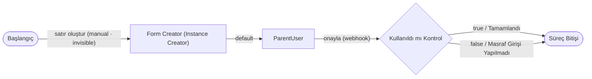
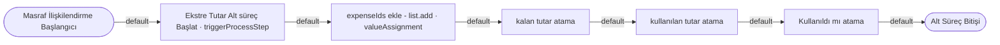
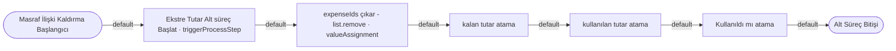

# Örnek Süreç — Ekstre Satırı (`creditCardStatementLine`) — TASLAK

> **Durum:** 🟡 TASLAK — görselden ilk çıkarım (diyagram + aksiyon/trigger taslağı). Detay sonra eklenecek.
> **Servis grubu:** `expenseAndCreditCard` (4 bağlantılı servis) → [`index.md`](./index.md)
> **Görsel:** `creditCardStatementLine.jpg`
> **Amaç:** Bir **kredi kartı ekstresinin tek satırı**. Her satır bir **Masraf** ile ilişkilendirilebilir; ilişki
> kurulunca/kaldırılınca satırın **ilişkili masraf id'leri (`expenseIds`) / kalan tutar / kullanılan tutar / kullanıldı mı** alanları güncellenir
> ve üst **Ekstre**'nin tutar alt süreci tetiklenir. Böylece ekstre satırının bir masrafla eşleşip eşleşmediği (kullanıldı mı) izlenir.

## Ana Süreç Diyagramı

## Alt Süreçler
**Masraf ilişkilendirme** (`subProcessStart`):

**Masraf ilişki kaldırma** (`subProcessStart`):

## Süreç adımları (taslak)
| # | Adım | Tip | Rol |
|---|---|---|---|
| 1 | Başlangıç | Süreç Başlangıcı | Tek aksiyon: **satır oluştur** (`manual`, **displayType=invisible**) — bağımsız başlatılamaz; yalnız Ekstre'nin `creditCardStatementLines` Form List'i üzerinden oluşur |
| 2 | Form Creator | Instance Creator | Ekstre satırı instance'ı üretir |
| 3 | ParentUser | **Üst Form Kullanıcı** (human task) | Üst Ekstre kullanıcısı; onaylar |
| 4 | Kullanıldı mı Kontrol | Karşılaştırma | Satır bir masrafla eşleşti mi? |
| — | Süreç Bitişi | Süreç Bitişi | true → Tamamlandı · false → Masraf Girişi Yapılmadı |
| — | Masraf İlişkilendirme Başlangıcı | **Alt Süreç Başlangıcı** (`subProcessStart`) | Masraf bağlanınca çalışır |
| — | Masraf İlişki Kaldırma Başlangıcı | **Alt Süreç Başlangıcı** (`subProcessStart`) | Masraf bağlantısı kalkınca çalışır |
| — | Ekstre Tutar Alt süreç Başlat | **triggerProcessStep** | Üst **Ekstre**'nin Tutar alt sürecini tetikler |
| — | expenseIds ekle / çıkar | Değer Atama | Gelen **expense instance id**'sini `expenseIds` listesine **list.add** ile ekler; kaldırmada **list.remove** ile çıkarır |
| — | kalan / kullanılan tutar atama | Değer Atama | Satır tutar alanlarını günceller |
| — | Kullanıldı mı atama | Değer Atama | Satırın "kullanıldı" bayrağını set eder |

## Aksiyonlar (taslak)
| Kaynak adım | Aksiyon | actionType | Hedef adım | Durum |
|---|---|---|---|---|
| Başlangıç | **satır oluştur** | `manual` · **actionDisplayType: `invisible`** | Form Creator | — |
| Form Creator | default | `autoAction` | ParentUser | — |
| ParentUser | onayla | `webhook` | Kullanıldı mı Kontrol | — |
| Kullanıldı mı Kontrol | true | (comparison) | Süreç Bitişi | Tamamlandı |
| Kullanıldı mı Kontrol | false | (comparison) | Süreç Bitişi | Masraf Girişi Yapılmadı |
| (alt süreç adımları) | default | `autoAction` | sıradaki adım | — |

## Önemli Alanlar (properties)
> **Kural:** Bu serviste **yalnız `amount` `enabled`/düzenlenebilir**; diğer alanlar **iş kuralları + süreç adımlarıyla** doldurulur.

| Alan (`code`) | Tip | Enabled | Açıklama |
|---|---|---|---|
| `amount` | Numeric | ✅ | Satır tutarı — **tek düzenlenebilir alan** (kullanıcı girer). |
| `remainingAmount` | Numeric | ❌ | `amount - usedAmount` (iş kuralı `remainingAmountAtama`). |
| `usedAmount` | Numeric | ❌ | Kullanılan tutar — **yalnız süreç adımıyla** atanır (iş kuralı yok). |
| `used` | Checkbox | ❌ | `remainingAmount == 0` (iş kuralı `usedAtama`). |
| `expenseIds` | **combobox** (`isMultiSelect = true`, `isAssociatedCombobox = false`) → **Masraf (`expense`)** | ❌ | İlişkili **masraf (`expense`) instance'larının** id'leri (liste) — **yalnız bilgi amaçlı**. **`isAssociatedCombobox = false`** → `AssociatedInstance` kaydı **oluşturmaz**; böylece **Masraf ↔ Ekstre Satırı döngüsü** (A→B→A) **önlenir**. Değerler alt süreçte parametreyle gelen expense id'sinin **list.add/list.remove**'uyla güncellenir. |
| `creditCardStatementId` | **parentProperty** → Ekstre.`creditCardStatementLines` | ❌ | Üst formdan — bu satırı `creditCardStatementLines` listesinde tutan **Ekstre**'den — **`creditCardStatementId` değerini kopyalar**; satırı ait olduğu ekstreye bağlar. |

## İş Kuralları (business rules)
> Model → [`../../models/service-settings/business-rule.md`](../../models/service-settings/business-rule.md). Frontend'de çalışır (realtime).

| Kural (`code`) | Hedef alan | Kaynak | businessRuleActionType | Davranış |
|---|---|---|---|---|
| `remainingAmountAtama` | `remainingAmount` | `amount - usedAmount` | `assignValueToProperty` (`fromCalculation`) | Kalan tutar = tutar − kullanılan. |
| `usedAtama` | `used` | `remainingAmount == 0` | `assignValueToProperty` (`fromCalculation`) | Kalan tutar 0 ise **`used = true`** (satır tümüyle kullanıldı). |

## ServiceTrigger (otomatik tetikleyiciler)
- Bu servis görselinde **ayrı ServiceTrigger tablosu yok**. Ekstre Satırı'nın alt süreçleri (**Masraf İlişkilendirme /
  İlişki Kaldırma Başlangıcı**), **Masraf** servisinin ServiceTrigger'ları ile tetiklenir (→ [`expense.md`](./expense.md)).

## Notlar / açık noktalar
- **Satır bağımsız oluşturulamaz:** Başlangıç aksiyonu **satır oluştur** (`manual`), **`actionDisplayType = invisible`**
  olduğundan "aksiyon bekleyenler"de **görünmez** — satır doğrudan başlatılamaz; **yalnız Ekstre'nin `creditCardStatementLines`
  Form List'i** üzerinden (yeni instance olarak) oluşturulur.
- **İsim setleri (netleşti):** Masraf'ın kendi alt süreçleri **"Forma Ekle / Formdan Çıkart Başlangıcı"** (Masraf ↔ Masraf Formu);
  bu servisin (Ekstre Satırı) alt süreçleri **"Masraf İlişkilendirme / Masraf İlişki Kaldırma Başlangıcı"** (Ekstre Satırı ↔ Masraf).
  İki ayrı çift; Masraf'ın trigger tablosu artık bu servisin adlarını kullanır (çakışma yok).
- **Ekstre Tutar Alt süreç Başlat** = `triggerProcessStep`; üst **Ekstre** servisinin **Tutar Başlangıcı** alt sürecini
  (kalan/kullanılan tutar) tetikler (→ [`creditCardStatement.md`](./creditCardStatement.md)).
- `false → Masraf Girişi Yapılmadı` kolu görselde Süreç Bitişi'ne ulaşıyor (farklı durumla); "geri dönüş mü, bitiş mi"
  sonra netleşecek.
- **Döngü önleme (tasarım deseni):** `expenseIds` **`isAssociatedCombobox = false`** olduğundan, Ekstre Satırı masraf(lar)ın
  id'sini **bilgi olarak** tutar ama **geri association kurmaz** → Masraf'ın ServiceTrigger'ı yeniden ateşlenmez, **A→B→A döngüsü
  oluşmaz**. _(ServiceTrigger "döngü koruması" açık maddesinin tasarım-zamanı örneği → [`../../models/service-settings/service-trigger.md`](../../models/service-settings/service-trigger.md).)_
- `expenseIds` alanı, alt süreçteki **"expenseIds ekle / çıkar"** adımlarıyla güncellenir: eklemede parametreyle gelen **expense instance id**'si **list.add** ile eklenir; kaldırmada **list.remove** ile çıkarılır.
- **`parentProperty` / `flowInfo` alan tipleri (açık):** `creditCardStatementId` (**parentProperty** — üst formdan değer kopyalar)
  ve Ekstre'deki `creditCardStatementId` (**flowInfo**) gibi özel alan tiplerinin **PropertyType** listesinde karşılığı teyit edilecek
  → [`../../models/enums/property-type.md`](../../models/enums/property-type.md). _(Parent Property, todo'da da açık: `process-step §4`.)_
- **İki hesaplama mekanizması (D3 — ikisi de gerekli):** `remainingAmount`/`used`/`usedAmount` **iki bağlamda** güncellenir:
  **(1) iş kuralı — frontend realtime:** kullanıcı satırda `amount`'ı düzenleyince instance üzerinde anında hesaplar (`remainingAmountAtama`/`usedAtama`);
  **(2) alt-süreç adımı — backend:** ilişkili **Masraf** servisinden eşleştirme/ayırma (ServiceTrigger) geldiğinde `usedAmount`'ı (ve türevlerini) günceller.
  Frontend-edit ↔ association-tetikleme **farklı kaynaklar** olduğundan çakışma değil, **tamamlayıcı**dır.
- İlişki: **Masraf → (association) → Ekstre Satırı → (içinde) → Ekstre**.

*Oluşturma: 2026-07-29.*
