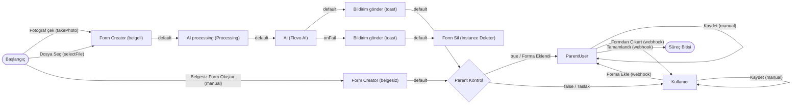
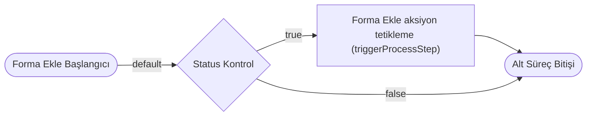
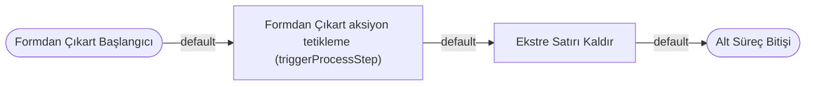

# Örnek Süreç — Masraf (`expense`) — TASLAK

> **Durum:** 🟡 TASLAK — görselden ilk çıkarım (diyagram + aksiyon/trigger taslağı). Detay sonra eklenecek.
> **Servis grubu:** `expenseAndCreditCard` (4 bağlantılı servis) → [`index.md`](./index.md)
> **Görsel:** `expense.jpg`
> **Amaç:** Tek bir **masraf** kaydının yaşam döngüsü. Masraf **3 yolla** oluşturulur (fotoğraf/dosya/belgesiz);
> belgeli yolda **Flovo AI** ile taranır. **Parent Kontrol** ile masrafın bir üst forma bağlı olup olmadığına göre
> **ParentUser** (üst formun kullanıcısı) veya bağımsız **Kullanıcı** akışına ayrılır. Masraf bir **Ekstre Satırı** ile
> ilişkilendirilince/ayrılınca **ServiceTrigger** ile Ekstre Satırı alt süreçleri tetiklenir.

## Ana Süreç Diyagramı

## Alt Süreçler
**Forma ekleme** (`subProcessStart` → Status Kontrol → aksiyon tetikleme):

**Formdan çıkarma** (`subProcessStart` → aksiyon tetikleme → Ekstre Satırı Kaldır):

## Süreç adımları (taslak)
| # | Adım | Tip | Rol |
|---|---|---|---|
| 1 | Başlangıç | Süreç Başlangıcı | 3 başlatma: `takePhoto` / `selectFile` / belgesiz `manual` |
| 2a | Form Creator (belgeli) | Instance Creator | Belgeli masraf instance'ı üretir → **AI processing** |
| 2b | Form Creator (belgesiz) | Instance Creator | Belgesiz masraf instance'ı üretir → **Parent Kontrol** |
| 3 | AI processing | Processing | Belge taranırken "yükleniyor" gösterimi |
| 4 | AI | Flovo AI | Masraf belgesini tarayıp alanları doldurur |
| 5 | Bildirim gönder | Bildirim (toast) | Sonuç/hata bildirimi |
| 6 | Form Sil | Instance Deleter | AI hatasında yarım formu siler (telafi) |
| 7 | Parent Kontrol | Karşılaştırma | **`expenseFormId` dolu mu?** → dolu: `true` → ParentUser · boş: `false` → Kullanıcı (Taslak) |
| 8 | Kullanıcı | Kullanıcı (human task) | Masraf **bir masraf formuyla ilişkilendirilmediğinde** durduğu adım (Taslak); kaydeder / forma ekler |
| 9 | ParentUser | **Üst Form Kullanıcı** (human task) | Masraf **bir masraf formuyla ilişkilendirildiğinde** ilerlediği adım; **masraf formunun süreç adımına göre** davranır (atananlar/görünüm üst formdan) |
| — | Süreç Bitişi | Süreç Bitişi | — |

## Aksiyonlar (taslak)
| Kaynak adım | Aksiyon | actionType | Hedef adım | Not |
|---|---|---|---|---|
| Başlangıç | Fotoğraf çek | `takePhoto` | Form Creator (belgeli) | belgeli |
| Başlangıç | Dosya Seç | `selectFile` | Form Creator (belgeli) | belgeli |
| Başlangıç | Belgesiz Form Oluştur | `manual` | Form Creator (belgesiz) | belgesiz |
| Form Creator (belgeli) | default | `autoAction` | AI processing | tek hedef |
| Form Creator (belgesiz) | default | `autoAction` | Parent Kontrol | tek hedef |
| AI processing | default | `autoAction` | AI | — |
| AI | default | `autoAction` | Bildirim gönder | başarı |
| AI | onFail | `autoAction` | Bildirim gönder → Form Sil | hata telafi |
| Bildirim gönder | default | `autoAction` | Parent Kontrol | — |
| Parent Kontrol | true | (comparison) | ParentUser | durum: Forma Eklendi |
| Parent Kontrol | false | (comparison) | Kullanıcı | durum: Taslak |
| Kullanıcı | Kaydet | `manual` | Kullanıcı (self) | — |
| Kullanıcı | Forma Ekle | `webhook` | ParentUser | — |
| ParentUser | Kaydet | `manual` | ParentUser (self) | — |
| ParentUser | Formdan Çıkart | `webhook` | Kullanıcı | durum: Taslak |
| ParentUser | Tamamlandı | `webhook` | Süreç Bitişi | — |

## Önemli Alanlar (properties)
| Alan (`code`) | Tip | Açıklama |
|---|---|---|
| `amount` | Numeric | Masraf tutarı. |
| `expenseId` | **flowInfo → instanceId** | Masrafın kimliği = kendi `instanceId`'si (akış bilgisinden; salt-okunur). |
| `expenseFormId` | **parentProperty** → Masraf Formu (`expenseForm`).`expenses` | Masraf'ı `expenses` listesinde tutan **Masraf Formu**'nun `expenseFormId` değerini **kopyalar** → masrafın **hangi masraf formuna** ait olduğunu belirler. |
| `creditCardStatementId` | **parentProperty** → Masraf Formu (`expenseForm`).`expenses` | Masraf'ı `expenses` listesinde tutan **Masraf Formu**'ndan `creditCardStatementId` değerini **kopyalar** → masrafın **hangi ekstreye ait** olduğunu belirler. |
| `matchedStatementLine` | **Combobox** — `isAssociatedCombobox = true`, `associatedServiceId = creditCardStatementLine` | Masrafı bir **Ekstre Satırı** ile eşleştirir. Seçim **association** kurar → **ServiceTrigger'ı tetikler** (bkz. `targetPropertyId`). Seçenekleri iş kuralı `matchedStatementLineDoldurma` doldurur. |

## İş Kuralları (business rules)
> Model → [`../../models/service-settings/business-rule.md`](../../models/service-settings/business-rule.md). Frontend'de çalışır (realtime).

| Kural (`code`) | Hedef | businessRuleActionType | Davranış |
|---|---|---|---|
| `matchedStatementLineDoldurma` | `matchedStatementLine` (veri kaynağı) | `fillDataSource` | `creditCardStatementLine` (Ekstre Satırı) instance'larından **`creditCardStatementId` bu forma eşit** **ve** **`used == false (0)`** olanları `matchedStatementLine` combobox'ının **veri kaynağına** doldurur → yalnız **aynı ekstreye ait, henüz kullanılmamış** satırlar seçilebilir. |

## ServiceTrigger (otomatik tetikleyiciler)
> Masraf, **`matchedStatementLine`** alanıyla (`isAssociatedCombobox=true`) bir **Ekstre Satırı** seçilince/kaldırılınca tetiklenir;
> izlenen alan **`targetPropertyId = matchedStatementLine`**. Hedef **Ekstre Satırı** servisinin alt süreç başlangıcı çalışır.

| serviceTriggerType | targetService | targetPropertyId | targetProcessStarter (`subProcessStart`) | async | parameters |
|---|---|---|---|---|---|
| `whenAddedAssociate` | Ekstre Satırı | `matchedStatementLine` | Masraf İlişkilendirme Başlangıcı | `false` | `expenseId`, `amount` |
| `whenRemoveAssociate` | Ekstre Satırı | `matchedStatementLine` | Masraf İlişki Kaldırma Başlangıcı | `true` | `expenseId`, `amount` |

## Notlar / açık noktalar
- **ParentUser** adımı = **Üst Form Kullanıcı** (§3.22) — masrafın üst formundan (Masraf Formu) atananları/görünümü devralır.
- **Forma Ekle aksiyon tetikleme** / **Formdan Çıkart aksiyon tetikleme** = `triggerProcessStep` (alt süreç içinde).
- **Ekstre Satırı Kaldır** adımının tipi/davranışı sonra netleşecek (Ekstre Satırı ilişki temizliği).
- Masraf'ın trigger'ı **Ekstre Satırı**'nı hedefler; oradaki başlangıçlar **"Masraf İlişkilendirme / Masraf İlişki Kaldırma
  Başlangıcı"**'dır (Masraf'ın kendi alt süreçleri "Forma Ekle / Formdan Çıkart Başlangıcı"dan ayrıdır → çakışmaz; → [`creditCardStatementLine.md`](./creditCardStatementLine.md)).
- `whenRemoveAssociate` **async=true** (çıkarmada beklenmez); `whenAddedAssociate` **async=false** (eklemede beklenir).
- **İlişki yönü / döngü:** ilişkiyi kuran **tek taraf** Masraf'tır — `matchedStatementLine` **`isAssociatedCombobox=true`**
  (association + trigger). Karşı taraf **Ekstre Satırı.`expenseIds`** `isAssociatedCombobox=false` (bilgi amaçlı, geri-association
  kurmaz) → **A→B→A döngüsü oluşmaz** (→ [`creditCardStatementLine.md`](./creditCardStatementLine.md)).
- **parentProperty hedefi (`creditCardStatementId` · `expenseFormId`):** `expenses` Form List'i **Masraf Formu (`expenseForm`)**
  servisinde olduğundan üst form = **Masraf Formu**'dur. _(Kullanıcı "expense" olarak belirtti; `expenses` listesi expenseForm'da olduğundan üst = expenseForm.)_
- **`flowInfo` / `parentProperty` alan tipleri (açık):** `expenseId` (flowInfo) · `expenseFormId` + `creditCardStatementId`
  (parentProperty) — **PropertyType** listesinde karşılıkları teyit edilecek → [`../../models/enums/property-type.md`](../../models/enums/property-type.md).

*Oluşturma: 2026-07-29.*
