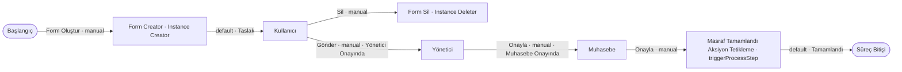

# Örnek Süreç — Masraf Formu (`expenseForm`) — TASLAK

> **Durum:** 🟡 TASLAK — görselden ilk çıkarım (diyagram + aksiyon/trigger taslağı). Detay sonra eklenecek.
> **Servis grubu:** `expenseAndCreditCard` (4 bağlantılı servis) → [`index.md`](./index.md)
> **Görsel:** `expenseForm.jpg`
> **Amaç:** Bir **masraf formunun** (üst form) yaşam döngüsü: kullanıcı formu oluşturur, içine **Form List** ile
> **Masraf** kayıtları ekler; form **Yönetici → Muhasebe** onay zincirinden geçip tamamlanır. Forma masraf
> eklenmesi/çıkarılması, **ServiceTrigger** ile **Masraf** servisinin alt süreçlerini otomatik tetikler.

## Ana Süreç Diyagramı

## Süreç adımları (taslak)
| # | Adım | Tip | Rol |
|---|---|---|---|
| 1 | Başlangıç | Süreç Başlangıcı | Form manuel oluşturulur |
| 2 | Form Creator | Instance Creator | Masraf formu instance'ı üretir |
| 3 | Kullanıcı | Kullanıcı (human task) | Formu doldurur, masraf ekler; gönderir veya siler |
| 4 | Form Sil | Instance Deleter | Taslağı siler (terminal kol) |
| 5 | Yönetici | Kullanıcı (human task) | Yönetici onayı |
| 6 | Muhasebe | Kullanıcı (human task) | Muhasebe onayı |
| 7 | Masraf Tamamlandı Aksiyon Tetikleme | **triggerProcessStep** | Tamamlanınca alt süreç/aksiyon tetikler |
| — | Süreç Bitişi | Süreç Bitişi | — |

## Aksiyonlar (taslak)
| Kaynak adım | Aksiyon | actionType | Hedef adım | Durum (changeStatus) |
|---|---|---|---|---|
| Başlangıç | Form Oluştur | `manual` | Form Creator | — |
| Form Creator | default | `autoAction` | Kullanıcı | Taslak |
| Kullanıcı | Sil | `manual` | Form Sil | — |
| Kullanıcı | Gönder | `manual` | Yönetici | Yönetici Onayında |
| Yönetici | Onayla | `manual` | Muhasebe | Muhasebe Onayında |
| Muhasebe | Onayla | `manual` | Masraf Tamamlandı Aksiyon Tetikleme | — |
| Masraf Tamamlandı Aksiyon Tetikleme | default | `autoAction` | Süreç Bitişi | Tamamlandı |

## Önemli Alanlar (properties)
| Alan (`code`) | Tip | Açıklama |
|---|---|---|
| `expenseFormId` | **flowInfo → instanceId** | Masraf formunun kimliği = kendi `instanceId`'si (akış bilgisinden; salt-okunur). Alt masraflar bu değeri `expenseFormId` (**parentProperty**) ile devralır (→ [`expense.md`](./expense.md)). |
| `expenses` | **Form List** → Masraf | Masraf servisinin **3 başlangıç aksiyonu** (`takePhoto` / `selectFile` / belgesiz `manual`) ile bu liste üzerinden **yeni masraf** oluşturulabilir; ayrıca **taslak** statüsündeki mevcut masraf instance'ları **"var olandan ekle"** ile listeye eklenebilir (`addFromExistingStatusIds = [taslak]`). Bu alan, Masraf'ı hedefleyen **ServiceTrigger'ın izlediği alandır** (`targetPropertyId`). |
| `creditCardStatement` | **Form List** → Kredi Kartı Ekstresi | Bu liste üzerinden **yeni ekstre instance'ı** oluşturularak eklenebilir. **İK-1** ile tek ekstre kısıtı uygulanır. |
| `creditCardStatementId` | **Textbox** | Bağlı ekstrenin `creditCardStatementId` değerini tutar (**İK-2** ile otomatik doldurulur). |

## İş Kuralları (business rules)
> Model → [`../../models/service-settings/business-rule.md`](../../models/service-settings/business-rule.md). Frontend'de çalışır (realtime).

| # | İzlenen alan | Tetikleme | `businessRuleActionType` | Davranış |
|---|---|---|---|---|
| **İK-1** | `creditCardStatement` | Form List'e instance eklendiğinde | `setViewForProperties` | Alanın **`enabled = false`** yapılır → **1'den fazla** ekstre eklenmesi önlenir (**max 1**). |
| **İK-2** | `creditCardStatementId` | `creditCardStatement`'a instance eklendiğinde | `assignValueToProperty` | Eklenen **ilk** ekstre instance'ının `creditCardStatementId` alan değeri bu textbox'a **yazılır**. |

## ServiceTrigger (otomatik tetikleyiciler)
> Model → [`../../models/service-settings/service-trigger.md`](../../models/service-settings/service-trigger.md).
> **İzlenen alan:** `expenses` (Form List) → `targetPropertyId`. Bu listeye bir **Masraf** eklenince/çıkınca tetiklenir; hedef
> **Masraf** servisinin ilgili **alt süreç başlangıcı** (`subProcessStart`) çalışır.

| serviceTriggerType | targetService | targetPropertyId | targetProcessStarter (`subProcessStart`) | async | parameters |
|---|---|---|---|---|---|
| `whenAddedAssociate` | Masraf | `expenses` | Forma Ekle Başlangıcı | `false` | — |
| `whenRemoveAssociate` | Masraf | `expenses` | Formdan Çıkart Başlangıcı | `false` | — |

## Notlar / açık noktalar
- **Masraf Tamamlandı Aksiyon Tetikleme** = `triggerProcessStep` (akış-üzeri); tamamlanan masraf formunda bir alt süreç/
  aksiyon tetikler. Detay (ne tetiklediği) sonra netleşecek.
- İlişki: **Masraf Formu → (Form List) → Masraf** (→ [`expense.md`](./expense.md)).

*Oluşturma: 2026-07-29.*
