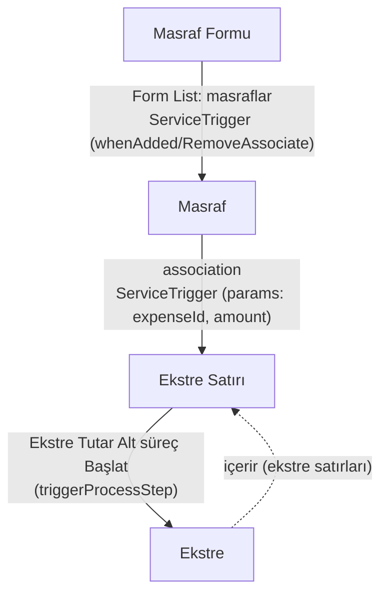

# Örnek Süreç Grubu — Masraf & Kredi Kartı Ekstresi (`expenseAndCreditCard`) — TASLAK

> **Durum:** 🟡 TASLAK — dört bağlantılı servisin görsellerinden ilk çıkarım (diyagram + aksiyon/trigger taslağı).
> **Detay sonra eklenecek** (adım-adım görev/ayar/parametre akışı).
> **Amaç:** **Birbirine bağlı 4 servisin** uçtan uca örneği — bir **masraf formu** içindeki masrafların, kredi kartı
> **ekstre satırlarıyla** eşleştirilerek "kullanıldı mı / kalan-kullanılan tutar" muhasebesinin **otomatik** yürütülmesi.
> **Odak:** yeni **ServiceTrigger** (servis-seviyesi otomatik tetikleyici) + **triggerProcessStep** (akış-üzeri tetikleme) +
> **Üst Form Kullanıcı** (ParentUser) birlikte nasıl çalışır.

## Servisler (her biri ayrı dosya)
| Servis | Kod | Görsel | Döküman |
|---|---|---|---|
| **Masraf Formu** (üst form) | `expenseForm` | `expenseForm.jpg` | [`expenseForm.md`](./expenseForm.md) |
| **Masraf** | `expense` | `expense.jpg` | [`expense.md`](./expense.md) |
| **Kredi Kartı Ekstresi / Ekstre** | `creditCardStatement` | `creditCardStatement.jpg` | [`creditCardStatement.md`](./creditCardStatement.md) |
| **Ekstre Satırı** | `creditCardStatementLine` | `creditCardStatementLine.jpg` | [`creditCardStatementLine.md`](./creditCardStatementLine.md) |

## Senaryolar (uçtan uca akış detayı)
> Süreç örneğini **senaryolarla** detaylandırma dosyası (servisler arası veri akışı adım adım) → [`scenarios.md`](./scenarios.md).
> İlk senaryo: **Yeni Masraf (expense) instance oluşturma** (🟡 taslak).

## Servisler arası ilişki (tetikleme zinciri)

- **Masraf Formu → Masraf:** Masraf Formu içindeki **Form List**'e bir masraf eklenince/çıkınca **ServiceTrigger**,
  Masraf servisinin **Forma Ekle / Formdan Çıkart Başlangıcı** alt sürecini tetikler (`async=false`).
- **Masraf → Ekstre Satırı:** Bir masraf, bir **Ekstre Satırı** ile ilişkilendirilince/ayrılınca **ServiceTrigger**,
  Ekstre Satırı'nın ilgili alt sürecini tetikler; parametre: `expenseId`, `amount` (ekleme `async=false`, kaldırma `async=true`).
- **Ekstre Satırı → Ekstre:** Ekstre Satırı, **"Ekstre Tutar Alt süreç Başlat"** (`triggerProcessStep`) ile üst
  **Ekstre**'nin **Tutar** alt sürecini (kalan/kullanılan tutar) tetikler.

## İlgili tasarım
- **ServiceTrigger** → [`../../models/service-settings/service-trigger.md`](../../models/service-settings/service-trigger.md)
  · enum [`../../models/enums/service-trigger-type.md`](../../models/enums/service-trigger-type.md)
- **Üst Form Kullanıcı (ParentUser)** → [`../../service-settings/process-step.md`](../../service-settings/process-step.md) §3.22
- **triggerProcessStep / subProcessStart** → [`../../models/enums/process-step-type.md`](../../models/enums/process-step-type.md)
- Adımlar/aksiyonlar → [`../../service-settings/process-step.md`](../../service-settings/process-step.md) ·
  [`../../service-settings/process-step-action.md`](../../service-settings/process-step-action.md)

## Açık noktalar (taslak → detay)
- **Başlangıç adı setleri (netleşti):** **Masraf**'ın alt süreçleri = **Forma Ekle / Formdan Çıkart Başlangıcı** (Masraf ↔ Masraf Formu);
  **Ekstre Satırı**'nın alt süreçleri = **Masraf İlişkilendirme / Masraf İlişki Kaldırma Başlangıcı** (Ekstre Satırı ↔ Masraf). İki ayrı çift, çakışmaz.
- **`targetPropertyId` / ilişki alanları:** her ServiceTrigger'ın izlediği tam alan (Form List / Combobox) detayda belirtilecek.
- **Ekstre ↔ Ekstre Satırı tetikleme yönü:** "Ekstre Tutar Alt süreç Başlat"ın tam mekaniği (parametreler, hangi ekstre) netleşecek.
- **`parameters` şekli:** `expenseId`, `amount` parametrelerinin `DynamicParameter` değer kaynağı (propertyValue vb.) detaylanacak.

*Oluşturma: 2026-07-29.*
