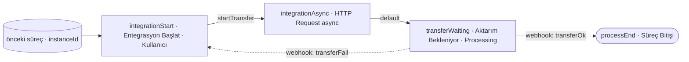

# Örnek Süreç — Entegrasyon / Asenkron Aktarım (integration)

## Amaç
Bir kaydı **dış bir sisteme aktarmak** (entegrasyon). Aktarım uzun sürebildiğinden **asenkron** yürütülür:
**HTTP Request `async = true`** ile aktarım başlatılır; kayıt **"Aktarım Bekleniyor"** durumuna alınır (kullanıcı
formu normal görür, loading yok) ve dış sistemden **Webhook** ile sonuç beklenir. Sonuç **başarılı** ise süreç biter;
**başarısız** ise akış başa (kullanıcıya) döner.

> **Görsel:** `integration.jpg`
> **Not:** Boş bırakılan adıma kadar bir akış vardır; bu bölüm **entegrasyon kısmıdır**. Adıma `parameters: { instanceId }` gelir.

## Diyagram

---

## Süreç Adımları

### 1. Entegrasyon Başlat (`integrationStart`) — Kullanıcı
**Görev:** Kullanıcının kaydı görüp **aktarımı başlatması**; başarısız aktarımda akışın geri döndüğü nokta.
**Bu adıma gelen parametre:** `parameters: { instanceId }` (önceki süreçten veya `transferFail` ile geri dönüşte
`{ instanceId, errorMessage }`).
**Ayarlar ve çalışma:** Form "aksiyon alınabilir" durumda gösterilir. Kullanıcı **"Aktar"** aksiyonunu manuel tetikler.
Geri dönüşte (`transferFail`) hata mesajı kullanıcıya görünür.
**Adımın ürettiği parametre:** — .

**Aksiyonlar:**
- **`startTransfer` (`manual`):** Kullanıcı tetikler. Hedef adım `integrationAsync`. Taşıdığı veri: `parameters: { instanceId }`.

---

### 2. Entegrasyon Async (`integrationAsync`) — HTTP Request (async)
**Görev:** Müşteri sunucusunda entegrasyon/aktarımı **başlatmak** (beklemeden).
**Bu adıma gelen parametre:** `parameters: { instanceId }`.
**Ayarlar ve çalışma:**
- `endpoint`: müşteri sunucusu entegrasyon ucu · `method`: `POST` · `body`: `{ instanceId }`
- **`async = true`** → dönüş beklenmez; doğrudan **`default`** aksiyonu tetiklenir.
- Müşteri sunucusunda entegrasyon **custom code** ile arka planda çalışır.
**Adımın ürettiği parametre:** — .

**Aksiyonlar:**
- **`default` (otomatik, async):** Hedef adım `transferWaiting`. Taşıdığı veri: `parameters: { instanceId }`.

---

### 3. Aktarım Bekleniyor (`transferWaiting`) — Processing
**Görev:** Aktarım dışarıda sürerken kaydı **"Aktarım Bekleniyor"** durumunda tutmak ve sonucu **webhook** ile beklemek.
**Bu adıma gelen parametre:** `parameters: { instanceId }`.
**Ayarlar ve çalışma:**
- **`showLoading = false`** → form **loading kartı değil**, **normal** görünür.
- Kaydın **durumu = "Aktarım Bekleniyor"** olarak güncellenir; aksiyonu tetikleyen kullanıcıya **güncel form bilgileri**
  iletilir (durum etiketiyle).
- Dışarıdan tetiklenecek **iki Webhook aksiyonu** tanımlıdır (sonuç koluna göre dallanır).
**Adımın ürettiği parametre:** — .

**Aksiyonlar:**
- **`transferOk` (`webhook`):** Müşteri sunucusu **başarıyla** bitince Flovo Customer API ile çağrılır. Hedef adım
  `processEnd`. Taşıdığı veri: `parameters: { instanceId }` (+ varsa sonuç).
- **`transferFail` (`webhook`):** Aktarım **başarısız** olursa çağrılır. Hedef adım `integrationStart` (başa dön).
  Taşıdığı veri: `parameters: { instanceId, errorMessage }`.

> Aynı bekleme noktası, gelen **webhook'un kodu** (`transferOk`/`transferFail`) ile **farklı `targetProcessStepId`'ye**
> yönlendirir — webhook ile dallanma örneği.

---

### 4. Süreç Bitişi (`processEnd`) — Süreç Bitişi
**Görev:** Entegrasyon başarıyla tamamlandığında süreci sonlandırmak.
**Bu adıma gelen parametre:** `parameters: { instanceId }`.
**Ayarlar ve çalışma:** Kimseyi bekletmez; süreç **biter**. Yetkili kullanıcılar kayda raporlardan/geçmişten erişebilir.
**Adımın ürettiği parametre:** — .
**Aksiyonlar:** — (terminal).

---

> İlgili tasarım: Processing → `../../service-settings/process-step.md` §3.18 · Webhook →
> `../../service-settings/process-step-action.md` §3.6 · API → `../../flovo-customer-api.md`.
