# Örnek Süreç — Yönlendirmeli Onay (referred)

## Amaç
Webhook ile başlayan bir onay talebinin, **Kontrol Grubu**ndan sonra gerektiğinde bir **"yönlendirilen kullanıcı"ya**
(ve onun **yöneticisine**) iletilip, o kullanıcının talebi **onaylayabildiği**, **başka birine yeniden
yönlendirebildiği** veya **onaylayıp bir sonrakine aktarabildiği** (zincir/döngü), en sonunda **Muhasebe** onayıyla
kapanan süreç. Örneğin ayırt edici yanı **`transferUser`** parametresinin akışıdır: yönlendirme hedefi olan kullanıcı,
üretilmediği adımlardan da **taşınmak** zorundadır. Bunu **`ProcessStepAction.mergeParameter`** sağlar: `true` ise aksiyon,
hedefe taşıdığı `parameters`'a **adıma gelen (`in`)** parametreleri de ekler (**aynı anahtarda ürettiği `out` ezer**).
Diyagramda **⚡merge** ile işaretli aksiyonlarda `mergeParameter = true`'dur.

> **Görsel:** `referred.jpg`
> **EventForm türleri:** **Yönlendir Event Form** (kullanıcı seçtiren pop-up) → `Yönlendir` · `Onayla ve Yönlendir`
> aksiyonları · **Reddet Event Form** (red/iade nedeni girdiren pop-up) → `Reddet` · `Geri Gönder` aksiyonları.

## Diyagram

```mermaid
flowchart LR
  start([start · Başlangıç]) -->|"default / webhook"| formCreator[formCreator · Form Creator · Instance Creator]
  formCreator -->|"default / autoAction · Kontrol Grubunda"| kontrol[kontrol · Kontrol Grup · Kullanıcı Grubu]

  kontrol -->|"Yönlendir / eventForm"| atama[atama · Yönlendirilen Kullanıcı Atama · Değer Atama]
  kontrol -->|"Onayla / manuel · Muhasebe Onayında"| muhasebe[muhasebe · Muhasebe Grup · Kullanıcı Grubu]
  muhasebe -->|"Geri Gönder / eventForm · Geri Gönderildi"| kontrol

  atama -->|"default / autoAction · Yönlendirilen Sorumlu Onayında"| yonlendirilen[yonlendirilen · Yönlendirilen Kullanıcı · Kullanıcı]

  yonlendirilen -->|"Yönlendir / eventForm"| atama
  yonlendirilen -->|"Onayla / manuel · Yönetici Onayında"| yonetici[yonetici · Yönetici · Kullanıcının Yöneticisi]
  yonlendirilen -->|"Onayla ve Yönlendir / eventForm · Yönetici Onayında"| yonetici
  yonetici -->|"Geri Gönder / eventForm · Geri Gönderildi"| yonlendirilen

  yonetici -->|"Onayla / manuel ⚡merge"| transfer{transfer · TransferUser Kontrol · Karşılaştırma}
  transfer -->|"true / autoAction · Muhasebe Onayında"| muhasebe
  transfer -->|"false / autoAction ⚡merge"| atama

  muhasebe -->|"Onayla / manuel · Tamamlandı"| bitis([bitis · Süreç Bitişi])
  muhasebe -->|"Reddet / eventForm · Reddildi"| bitis
```

---

## Süreç Adımları

### 1. Başlangıç (`start`) — Süreç Başlangıcı
**Görev:** Süreci **dışarıdan (webhook)** başlatmak.
**Bu adıma gelen parametre:** `parameters: { ... }` (webhook gövdesi — formu ilk-değerlemek için).
**Ayarlar ve çalışma:** Webhook aksiyonu ile tetiklenir; **`default`** ile ilerler (→ `../../service-settings/process-step-action.md` §3.6).
**Adımın ürettiği parametre:** webhook parametreleri (forma ilk değer atanmak üzere taşınır).

**Aksiyonlar:**
- **`default` (webhook):** Hedef adım `formCreator`. Taşıdığı veri: `parameters: { ... }` (webhook gövdesi).

---

### 2. Form Creator (`formCreator`) — Instance Creator (autoAction)
**Görev:** Formu (instance) oluşturup **webhook parametreleriyle form alanlarına ilk değer atamak** ve akışı kontrol grubuna vermek.
**Bu adıma gelen parametre:** `parameters: { ... }` (webhook gövdesi).
**Ayarlar ve çalışma:** Instance Creator init eşlemesiyle gelen parametreler form alanlarına yazılır; durum **Kontrol Grubunda** yapılır (→ `../../service-settings/process-step.md` §3.12).
**Adımın ürettiği parametre:** — (değerler forma yazıldı).

**Aksiyonlar:**
- **`default` (autoAction):** Hedef adım `kontrol` [durum: **Kontrol Grubunda**].

---

### 3. Kontrol Grup (`kontrol`) — Kullanıcı Grubu
**Görev:** "Kontrol Grubu"nun talebi **doğrudan onaylaması** ya da **bir kullanıcıya yönlendirmesi**.
**Bu adıma gelen parametre:** — (form değerleri hazır).
**Ayarlar ve çalışma:** Grup üyelerinden biri aksiyon alır. **Yönlendir**, **Yönlendir Event Form** pop-up'ıyla bir kullanıcı seçtirir; seçilen kullanıcı **`transferUser`** parametresi olur.
**Adımın ürettiği parametre:** `Yönlendir` → `{ transferUser }`.

**Aksiyonlar:**
- **`Onayla` (manuel):** Hedef adım `muhasebe` [durum: **Muhasebe Onayında**] — yönlendirmeden doğrudan muhasebeye.
- **`Yönlendir` (eventForm):** Hedef adım `atama`. Taşıdığı veri: `parameters: { transferUser }`.

---

### 4. Yönlendirilen Kullanıcı Atama (`atama`) — Değer Atama
**Görev:** Gelen **`transferUser`**'ı, formdaki **"Yönlendirilen Kullanıcı"** alanına **değer olarak atamak**.
**Bu adıma gelen parametre:** `parameters: { transferUser }`.
**Ayarlar ve çalışma:** Değer Atama adımı; `transferUser` → form alanı **"Yönlendirilen Kullanıcı"** (→ `../../service-settings/process-step.md` §3.4). Değer **forma yazıldıktan sonra `transferUser` parametresi ileri taşınmaz (tüketilir)**; durum **Yönlendirilen Sorumlu Onayında** yapılır.
**Adımın ürettiği parametre:** — (değer forma yazıldı; `transferUser` tüketildi).

**Aksiyonlar:**
- **`default` (autoAction):** Hedef adım `yonlendirilen` [durum: **Yönlendirilen Sorumlu Onayında**].

---

### 5. Yönlendirilen Kullanıcı (`yonlendirilen`) — Kullanıcı (dinamik)
**Görev:** Formdaki **"Yönlendirilen Kullanıcı"** alanındaki kişiye atanan talebin **onaylanması**, **yeniden
yönlendirilmesi** veya **onaylanıp bir sonrakine aktarılması**.
**Bu adıma gelen parametre:** — (`transferUser` bir önceki adımda tüketildi).
**Ayarlar ve çalışma:** Atanan kullanıcı, form alanından **dinamik** olarak belirlenir. **Yönlendir** ve **Onayla ve
Yönlendir**, **Yönlendir Event Form** pop-up'ıyla **yeni bir `transferUser`** seçtirir.
**Adımın ürettiği parametre:** `Yönlendir` → `{ transferUser }` · `Onayla ve Yönlendir` → `{ transferUser }` · `Onayla` → — .

**Aksiyonlar:**
- **`Onayla` (manuel):** Hedef adım `yonetici` [durum: **Yönetici Onayında**]. "Bu form bilgilerini onayladım"; yeni `transferUser` üretmez.
- **`Yönlendir` (eventForm):** Hedef adım `atama`. "Bu form benimle ilgili değil" → seçilen kullanıcıya yeniden atanır. Taşıdığı veri: `parameters: { transferUser }`.
- **`Onayla ve Yönlendir` (eventForm):** Hedef adım `yonetici` [durum: **Yönetici Onayında**]. Onaylar **ve** bir sonraki kullanıcıyı seçer. Taşıdığı veri: `parameters: { transferUser }`.
- **`Geri Gönder` (eventForm):** `yonetici`'den bu adıma iade gelir [durum: **Geri Gönderildi**].

---

### 6. Yönetici (`yonetici`) — Kullanıcı (Kullanıcının Yöneticisi)
**Görev:** **Yönlendirilen Kullanıcı** adımında **aksiyon alan kişinin yöneticisinin** onayı ya da iadesi.
**Bu adıma gelen parametre:** `parameters: { transferUser }` — yalnız **Onayla ve Yönlendir**'den gelindiyse dolu; **Onayla**'dan gelindiyse boş.
**Ayarlar ve çalışma:** Kullanıcı adımı, `userType = kullanıcının yöneticisi`; **kaynak adım = Yönlendirilen Kullanıcı** (o adımda son aksiyonu alanın yöneticisi burada sahiptir → `../../service-settings/process-step.md` §3.15). **Geri Gönder**, **Reddet Event Form** ile red nedeni girdirir.
**Adımın ürettiği parametre:** — (yeni parametre üretmez).

**Aksiyonlar:**
- **`Onayla` (manuel) — `mergeParameter = true`:** Hedef adım `transfer`. Kendi çıktısı yoktur; birleştirme ile **gelen
  `transferUser` korunur** ve karşılaştırma adımına taşınır → `parameters: { transferUser }` (varsa).
- **`Geri Gönder` (eventForm):** Hedef adım `yonlendirilen` [durum: **Geri Gönderildi**].

---

### 7. TransferUser Kontrol (`transfer`) — Karşılaştırma
**Görev:** Gelen **`transferUser`** parametresinin **boş olup olmadığına** göre dallanmak.
**Bu adıma gelen parametre:** `parameters: { transferUser }` (boş veya dolu).
**Ayarlar ve çalışma:** Karşılaştırma adımı; **`transferUser` boş → `true`**, **dolu → `false`**. Yeni parametre üretmez.
**Adımın ürettiği parametre:** — .

**Aksiyonlar:**
- **`true` (autoAction):** `transferUser` **boş** — yönlendirme kalmadı. Hedef adım `muhasebe` [durum: **Muhasebe Onayında**].
- **`false` (autoAction) — `mergeParameter = true`:** `transferUser` **dolu** — yeniden atama. Hedef adım `atama`;
  birleştirme ile gelen **`transferUser` `atama`'ya taşınır** → `parameters: { transferUser }`.

---

### 8. Muhasebe Grup (`muhasebe`) — Kullanıcı Grubu
**Görev:** Muhasebenin nihai onayı, reddi veya kontrol grubuna iadesi.
**Bu adıma gelen parametre:** — .
**Ayarlar ve çalışma:** Statik **"Muhasebe"** kullanıcı grubu aksiyon alır. **Reddet** ve **Geri Gönder**, **Reddet Event Form** ile neden girdirir.
**Adımın ürettiği parametre:** — .

**Aksiyonlar:**
- **`Onayla` (manuel):** Hedef adım `bitis` [durum: **Tamamlandı**].
- **`Reddet` (eventForm):** Hedef adım `bitis` [durum: **Reddildi**].
- **`Geri Gönder` (eventForm):** Hedef adım `kontrol` [durum: **Geri Gönderildi**].

---

### 9. Süreç Bitişi (`bitis`) — Süreç Bitişi
**Görev:** Süreci sonlandırmak (**Tamamlandı** / **Reddildi**). Kimseyi bekletmez; yetkililer sonradan erişip formu geri taşıyabilir (→ `../../service-settings/process-step.md` §3.17).
**Bu adıma gelen parametre:** — .
**Ayarlar ve çalışma:** Bitiş görüntüleme profili + bitiş sonrası erişebilecek gruplar.
**Aksiyonlar:** — (terminal; süreç biter).

---

> İlgili tasarım: **`mergeParameter`** → `../../service-settings/process-step-action.md` §2.1 · model alanı →
> `../../models/service-settings/process-step-action.md` · motor döngüsü → `../../flovo-bpm-engine.md` §4.4 ·
> Değer Atama → `../../service-settings/process-step.md` §3.4 · Karşılaştırma → §3.13 · Kullanıcı (yönetici kaynağı) →
> §3.15 · eventForm/Webhook aksiyonları → `../../service-settings/process-step-action.md` §3.2 / §3.6.
