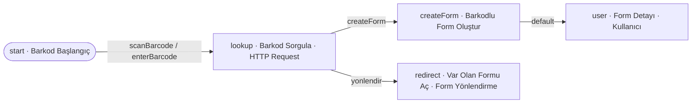

# Örnek Süreç — Barkod Tara / Var Olanı Aç (scanBarcode)

## Amaç
Bir **barkod** ile çalışmak: kullanıcı barkodu **tarar** veya **elle girer**. Bu barkodla **daha önce bir form
oluşturulmuşsa**, yenisi açılmaz — **var olan form açılır** (Form Yönlendirme). Form yoksa, barkodu içeren **yeni bir
form** oluşturulur. Karar, müşteri sunucusunun yanıtındaki **`response.action`** koduyla verilir (`createForm` ↔ `yonlendir`).

> **Görsel:** `scanBarcode.jpg`

## Diyagram

---

## Süreç Adımları

### 1. Barkod Başlangıç (`start`) — Süreç Başlangıcı
**Görev:** Sürecin barkod ile başlatılmasını sağlamak. İki başlatma aksiyonu "aksiyon bekleyenler" ekranında görünür.
**Bu adıma gelen parametre:** — (süreç burada başlar).
**Ayarlar ve çalışma:** Kullanıcı barkodu **tarayarak** veya **elle girerek** süreci başlatır; girilen barkod parametre
olarak taşınır.
**Adımın ürettiği parametre:** `barcode` (taranan/girilen değer).

**Aksiyonlar:**
- **`scanBarcode` (Barcode Tara):** Barkod okuyucu açılır; okunan değer alınır. Hedef adım `lookup`. Taşıdığı veri:
  `parameters: { barcode }`.
- **`enterBarcode` (withForm):** Açılan pop-up formda **`barcode`** adında **required textbox** vardır; kullanıcı elle girer.
  Hedef adım `lookup`. Taşıdığı veri: `parameters: { barcode }`.

---

### 2. Barkod Sorgula (`lookup`) — HTTP Request (Function)
**Görev:** Barkodu müşteri sunucusuna sorup, bu barkodla **var olan form olup olmadığını** öğrenmek ve sonuca göre dallanmak.
**Bu adıma gelen parametre:** `parameters: { barcode }`.
**Ayarlar ve çalışma:**
- `endpoint`: müşteri sunucusu barkod sorgu ucu · `method`: `POST` · `body`: `{ barcode }`
- **`async = false`** → dönüş **beklenir**.
- Müşteri sunucusu, **Flovo Customer API** (`POST /forms/search`) ile barkodu var olan formlarda arar ve bir **action
  modeli** döner:
  - **Form varsa** → `action = "yonlendir"`, `parameters: { formId }`.
  - **Form yoksa** → `action = "createForm"`, `parameters: { barcode }`.
- Adım, response'taki **`action` koduna** göre **kendi altındaki aynı kodlu aksiyonu** tetikler.
**Adımın ürettiği parametre:** response'tan gelen `action` + `parameters` (`formId` ya da `barcode`).

**Aksiyonlar:**
- **`createForm` (Autoaction):** response `action = createForm` ise tetiklenir. Hedef adım `createForm`. Taşıdığı veri:
  `parameters: { barcode }`.
- **`yonlendir` (Autoaction):** response `action = yonlendir` ise tetiklenir. Hedef adım `redirect`. Taşıdığı veri:
  `parameters: { formId }`.

---

### 3. Barkodlu Form Oluştur (`createForm`) — Form Creator
**Görev:** Barkodu içeren **yeni bir form** üretmek.
**Bu adıma gelen parametre:** `parameters: { barcode }`.
**Ayarlar ve çalışma:** Form Creator ayarında **init değer**: `barcode` form alanına, gelen `parameters.barcode`
eşlenir. Yeni **form id** ve alanlar üretilir; barcode alanı bu değerle dolu gelir.
**Adımın ürettiği parametre:** `formId`.

**Aksiyonlar:**
- **`default` (Autoaction):** Hedef adım `user`. Taşıdığı veri: `parameters: { formId }`.
  → Tetikleyen HTTP isteğine response olarak form bilgileri döner; frontendde yeni form görüntülenir.

---

### 4. Var Olan Formu Aç (`redirect`) — Form Yönlendirme
**Görev:** Barkodla eşleşen **daha önce oluşturulmuş formu** açmak (yeni form oluşturmadan).
**Bu adıma gelen parametre:** `parameters: { formId }` (var olan formun id'si).
**Ayarlar ve çalışma:** Yeni form **oluşturulmaz**; `formId` ile var olan formun bilgileri, aksiyonu tetikleyen
kullanıcıya iletilir ve o form açılır. Bu kol burada **biter** (kullanıcı var olan formun kendi sürecine geçer).
**Adımın ürettiği parametre:** — .
**Aksiyonlar:** — (terminal; var olan formu açar).

---

### 5. Form Detayı (`user`) — Kullanıcı
**Görev:** Yeni oluşturulan barkodlu formu kullanıcıya göstermek (insan görev noktası).
**Bu adıma gelen parametre:** `parameters: { formId }`.
**Ayarlar ve çalışma:** Form "aksiyon alınabilir" durumda gösterilir; kullanıcı formu görüntüler/düzenler.
**Adımın ürettiği parametre:** — .
**Aksiyonlar:** — (insan-tetiklemeli; bu örneğin kapsamı dışında).

---

> İlgili tasarım: `response.action` → `../../servis-ayarlari/process-step-action.md` §1.2 · Form Yönlendirme →
> `../../servis-ayarlari/process-step.md` §3.19 · API → `../../flovo-customer-api.md`.
